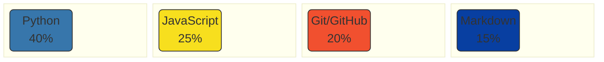
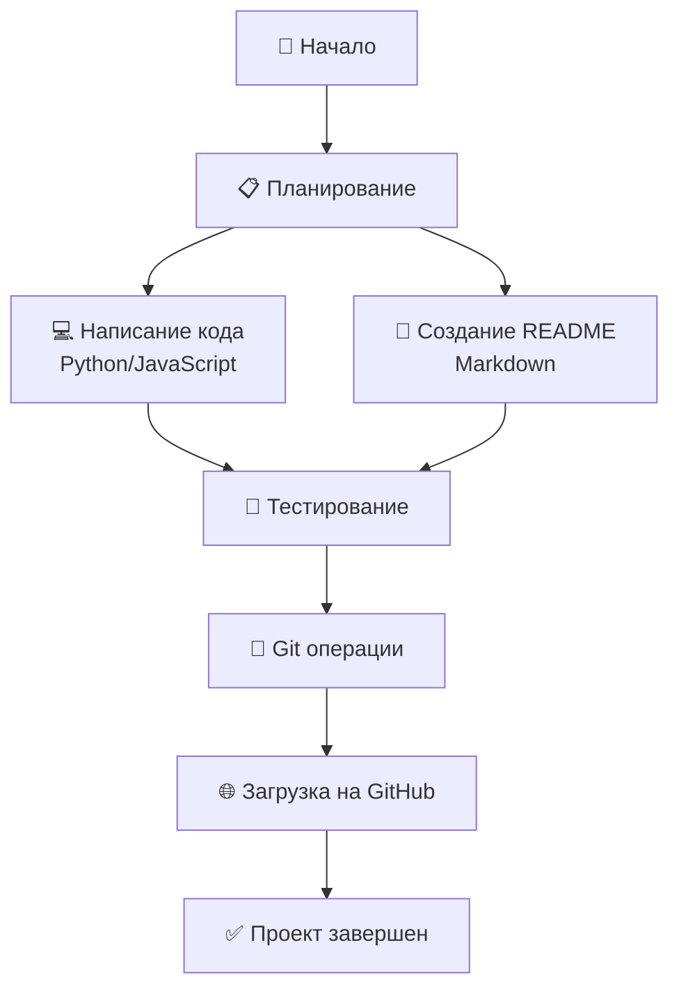
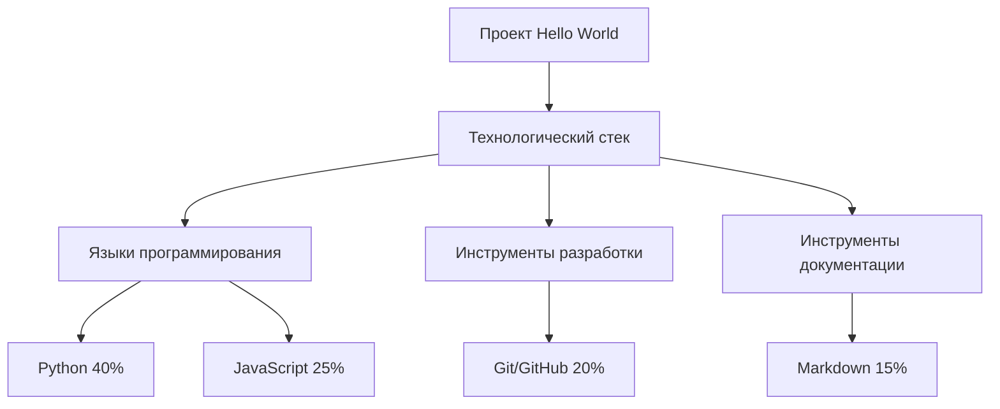

# 🌍 Hello, World! Project
[](https://opensource.org/licenses/MIT)
[](http://makeapullrequest.com)

**Самый креативный проект "Hello, World!" на GitHub** — демонстрация возможностей Markdown и Git для начинающих разработчиков.
---

## 🎯 Быстрый старт в Codespace

### 1️⃣ **Откройте в Codespace**
Нажмите кнопку выше или:
1. Перейдите в ваш репозиторий
2. Нажмите **"Code"** → **"Codespaces"**
3. Создайте новый Codespace

### 2️⃣ **Запустите проект**
```bash
# В терминале Codespace:
cd src
python hello.py
# Или:
node hello.js
```
### 3️⃣ **Редактируйте и сохраняйте**
Все изменения автоматически сохраняются!


## 📑 Навигация
- [📖 О проекте](#о-проекте)
- [🚀 Быстрый старт](#быстрый-старт)
- [🛠 Работа в консоли](#работа-в-консоли)
- [💻 Примеры кода](#примеры-кода)
- [📊 Сравнение с аналогами](#сравнение-с-аналогами)
- [📈 Диаграммы](#диаграммы)
- [🏗 Структура проекта](#структура-проекта)

## 📖 О проекте
### Этот проект демонстрирует лучшие практики создания документации с использованием:

**GitHub Codespaces** для разработки в облаке

**Markdown** для оформления

**Git** для контроля версий

### *"Хорошая документация — половина успеха проекта!"*

## 🛠 Работа в Codespace

### **Преимущества Codespace:**

| Возможность | Описание |
|-------------|----------|
| ⚡ **Мгновенный запуск** | Не требуется установка ПО |
| ☁️ **Облачная среда** | Работайте с любого устройства |
| 🔧 **Готовые инструменты** | Git, редактор, терминал в одном месте |
| 💾 **Автосохранение** | Не беспокойтесь о сохранении файлов |

### **Полезные команды:**

```bash
# Просмотр структуры проекта
tree

# Запуск Python кода
python src/hello.py

# Проверка статуса Git
git status
```

## 💻 Примеры кода

### **Python (src/hello.py):**
```python
def hello_world():
    """Выводит приветственное сообщение"""
    message = "Hello from Codespace! 🚀"
    print(f"{message}\n{'=' * len(message)}")
    return True

if __name__ == "__main__":
    success = hello_world()
    print(f"Выполнено: {success}")
```
### **JavaScript (src/hello.js):**
```javascript
// Современный ES6+ синтаксис
class HelloWorld {
    constructor() {
        this.message = "Hello from GitHub Codespaces!";
    }
    
    display() {
        console.log(`📢 ${this.message}`);
        console.log(`⏱ ${new Date().toLocaleTimeString()}`);
    }
}

// Использование
const hello = new HelloWorld();
hello.display();
text
```
## 📊 Сравнение с аналогами

| Функция | Наш проект | Обычный README | Lazyjournal |
|---------|------------|----------------|-------------|
| Работа в браузере | ✅ Codespace | ❌ Требует настройки | ❌ |
| Автосохранение | ✅ | ❌ | ⚠️ Частично |
| Готовые примеры | ✅ 10+ | ❌ | ✅ 5 |
| Интерактивность | ✅ Высокая | ❌ | ⚠️ Низкая |
| Совместная работа | ✅ Отличная | ❌ | ⚠️ Ограниченная |
| Бесплатно | ✅ 60 часов/мес | ✅ | ❌ |
| Поддержка Markdown | ✅ Полная | ✅ | ⚠️ Ограниченная |
| Облачное хранение | ✅ GitHub | ❌ | ⚠️ Требует регистрации

## 📈 Диаграммы Mermaid

### **1. Распределение технологий в проекте:**



### **2. Процесс работы над проектом:**



### **3. Визуализация технологического стека:**

